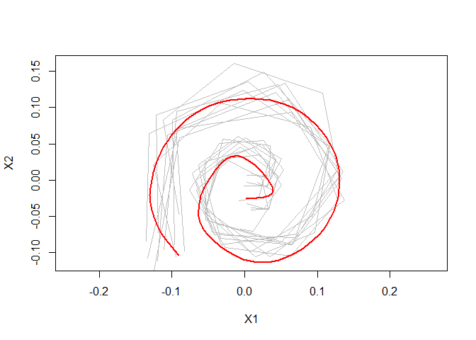

<!-- README.md is generated from README.Rmd. Please edit that file -->

# elastes

<!-- badges: start -->

[](https://github.com/mpff/elastes/actions/workflows/R-CMD-check.yaml)
[](https://app.codecov.io/gh/mpff/elastes)
[](https://lifecycle.r-lib.org/articles/stages.html#experimental)
<!-- badges: end -->

elastes is a R package that provides functions for the computation of
functional elastic shape means over sets of open planar curves. The
package is particularly suitable for settings where these curves are
only sparsely and irregularly observed. It uses a novel approach for
elastic shape mean estimation, where planar curves are treated as
complex functions and a full Procrustes mean is estimated from the
corresponding smoothed Hermitian covariance surface. This is combined
with the methods for elastic mean estimation proposed in [Steyer,
Stöcker, Greven (2022)](https://doi.org/10.1111/biom.13706). See
[Stöcker et. al. (2022)](https://doi.org/10.48550/arXiv.2203.10522) for
details.

## Installation

You can install the development version from
[GitHub](https://github.com/) with:

``` r
# install.packages("devtools")
devtools::install_github("mpff/elastes")
```

## Example

Calculate a smooth elastic shape mean for sparse spirals.

``` r
library(elastes)

# define spiral curve
curve <- function(t){
  rbind(t*cos(13*t), t*sin(13*t))
}

# randomly draw sparse spirals with noise
set.seed(18)
data_curves <- lapply(1:10, function(i){
  m <- sample(10:15, 1)
  delta <- abs(rnorm(m, mean = 1, sd = 0.05))
  t <- cumsum(delta)/sum(delta)
  data.frame(t(curve(t)) + 0.07*t*matrix(cumsum(rnorm(2*length(delta))),
             ncol = 2))
})

# apply random rotation and scaling to spiral curves
rand_scale <- function(curve){ ( 0.5 + runif(1) ) * curve }
rand_rotate <- function(curve){
  names <- colnames(curve)
  theta <- 2*pi*runif(1)
  mat <- matrix(c(cos(theta), sin(theta), -sin(theta), cos(theta)), nrow = 2, ncol = 2)
  curve.rot <- as.matrix(curve) %*% t(mat)
  curve.rot <- as.data.frame(curve.rot)
  colnames(curve.rot) <- names
  return(curve.rot)
}
data_curves <- lapply(data_curves, rand_scale)
data_curves <- lapply(data_curves, rand_rotate)

# compute smooth procrustes mean using a 2nd order penalty in the estimation
knots <- seq(0,1, length = 11)
elastic_shape_mean <- compute_elastic_shape_mean(
  data_curves,
  knots = knots,
  type = "smooth",
  penalty = 2
)
plot(elastic_shape_mean)
```

<!-- -->
